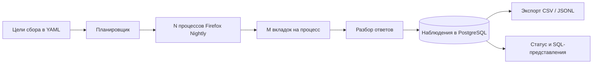

# yandex-market-collector

Неофициальный сборщик данных Яндекс Маркета через браузер. Он запускает **N процессов Firefox Nightly × M вкладок**, собирает данные по произвольным целям из YAML, сохраняет наблюдения в PostgreSQL и выгружает их в CSV или JSONL. Сборщик не оценивает товары и не отправляет уведомления о ценах.

Проект не связан с Яндексом и не обходит CAPTCHA. Пользователь сам отвечает за соблюдение правил сайта. Рекомендуется задавать умеренную частоту запросов и прекращать сбор при появлении проверки.

## Как это работает



Для каждой включённой цели задаётся поисковый запрос или прямая ссылка на `https://market.yandex.ru`, интервал сбора и, при необходимости, ограничения на число страниц или результатов. Рабочие процессы получают из PostgreSQL цели, для которых наступило время сбора. Вкладка Firefox открывает страницу, прокручивает её и перехватывает ответы Маркета. Парсер сохраняет исходные данные в JSONB и, когда поля доступны, извлекает идентификаторы, название, цену, справочную цену, продавца, наличие, ссылку, изображение и позицию. Поле `reference_price_minor` отражает данные источника, а не объективную скидку. Денежные суммы хранятся целым числом в минимальных единицах валюты.

При изменении значимого поля наблюдение записывается сразу. Полностью одинаковые наблюдения для одной цели, товара и предложения сохраняются не чаще раза в 24 часа. Исходный JSON каждого сохранённого наблюдения остаётся доступен. При проверке со стороны сайта или ответе 403/429 текущий запуск прекращается, а общий механизм охлаждения приостанавливает новые запросы.

## Требования

- Go 1.25 или новее (проверено с Go 1.26.4)
- PostgreSQL 14 или новее
- Firefox Nightly и драйвер Playwright с зависимостями браузера, необходимыми для `playwright-go`

Браузер работает на основной машине; Docker Compose запускает только PostgreSQL. На macOS автоматически определяется стандартная установка Firefox Nightly в `/Applications/Firefox Nightly.app`. На других системах укажите `browser.executable` или `YANDEX_FIREFOX_EXECUTABLE`. Поле `browser.profile_dir` нужно только для постоянных профилей: сборщик создаёт отдельный каталог `process-N` для каждого процесса браузера. Не используйте один профиль одновременно в нескольких процессах.

## Быстрый запуск

Если драйвер Playwright и соответствующая сборка Firefox Nightly ещё не установлены, установите их:

```bash
go run github.com/mxschmitt/playwright-go/cmd/playwright@v0.6201.1 install firefox
```

Скопируйте конфигурацию, задайте свои цели сбора и путь к Firefox Nightly. На macOS официальная установка в `/Applications/Firefox Nightly.app` определяется автоматически. Если используете браузер из Playwright, найдите `Nightly.app/Contents/MacOS/firefox` в его кеше и укажите полный путь в `browser.executable`. Поле `browser.driver_dir` задаёт нестандартный каталог драйвера. Чтобы видеть работу браузера, установите `headless: false`.

```bash
cp config.example.yaml config.yaml
# Отредактируйте config.yaml, затем:
docker compose up -d postgres
go build -o yandex-market-collector ./cmd/collector
./yandex-market-collector run --config config.yaml
```

Если Docker не используется, укажите в `database.url` адрес существующей базы PostgreSQL.

Пример настройки целей:

```yaml
browser:
  processes: 4
  tabs_per_process: 2
targets:
  - key: laptops
    enabled: true
    query: "ноутбук"
    interval: 30m
    max_pages: 5
  - key: custom-url
    enabled: true
    url: "https://market.yandex.ru/search?text=монитор"
    interval: 1h
    max_results: 200
```

Переменные `YANDEX_BROWSER_PROCESSES` и `YANDEX_TABS_PER_BROWSER` переопределяют число процессов и вкладок. `DATABASE_URL`, `YANDEX_FIREFOX_EXECUTABLE` и `YANDEX_FIREFOX_PROFILE_DIR` также имеют приоритет над YAML. При загрузке конфигурации проверяются ключи целей, интервалы и домен прямых ссылок.

## Команды CLI

```bash
./yandex-market-collector migrate --config config.yaml
./yandex-market-collector run --config config.yaml
./yandex-market-collector status --config config.yaml
./yandex-market-collector targets --config config.yaml
./yandex-market-collector export --config config.yaml --format csv --since 24h --target laptops --output laptops.csv
./yandex-market-collector export --config config.yaml --format jsonl --until 2026-10-03T00:00:00Z --output observations.jsonl
```

Параметры `--since` и `--until` принимают интервал в формате Go относительно текущего момента или дату и время RFC3339. Верхняя граница периода не включается в результат. Без `--output` данные выводятся в stdout. Файлы создаются с правами 0600; существующий файл не перезаписывается. Экспорт читает строки последовательно и не загружает всю таблицу в память.

Для фоновой работы есть вспомогательный скрипт:

```bash
./scripts/collector start
./scripts/collector status
./scripts/collector logs
./scripts/collector restart
./scripts/collector stop
```

Скрипт ротирует журналы при достижении 10 МиБ и сохраняет две предыдущие копии. Команда `status` показывает активность процесса, число браузеров и вкладок, состояние рабочих процессов и очереди, последние запуски, проверки со стороны сайта, ответы 403/429, состояние механизма охлаждения, доступность базы и число наблюдений в минуту. Пустой результат сбора не считается ошибкой.

## Анализ данных через SQL

```sql
SELECT * FROM latest_observations LIMIT 20;
SELECT target_key, source_product_id, observed_at, price_minor
FROM price_history WHERE target_key='laptops' ORDER BY observed_at DESC LIMIT 100;
SELECT * FROM target_daily_stats ORDER BY day DESC;
SELECT * FROM collection_run_stats;
```

Подробнее: [модель данных](docs/DATA_MODEL.md), [аналитика](docs/ANALYTICS.md) и [архитектура](docs/ARCHITECTURE.md).

## Ограничения

Формат ответов источника может меняться. Не каждая видимая карточка обязательно попадает в перехваченный JSON; парсер допускает отсутствие отдельных полей. Совместимость Firefox Nightly зависит от установленной версии Playwright. При проверке со стороны сайта сбор прекращается; решения CAPTCHA нет. Для большой базы потребуются обычные меры сопровождения PostgreSQL, в том числе резервное копирование и политика хранения данных. В проекте нет аутентификации, веб-интерфейса и распределённого управления браузерами.

Лицензия — MIT.
