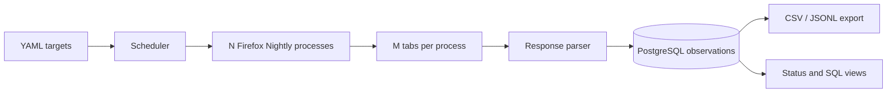

# yandex-market-collector

An unofficial, browser based Yandex Market data collector. It runs **N Firefox Nightly processes × M tabs**, schedules arbitrary YAML targets, stores source observations in PostgreSQL, and streams CSV or JSONL exports. It does not judge listings or send price alerts.

The project is not affiliated with Yandex. It does not bypass CAPTCHA. You are responsible for following the site's rules; use moderate request rates and stop when the source presents a challenge.

## How it works



Each enabled target has a query or a direct `https://market.yandex.ru` URL, an interval, and optional page/result limits. Workers claim due targets in PostgreSQL. A real Firefox tab navigates, scrolls, and observes Yandex responses. The parser keeps source metadata as JSONB and extracts identity, title, price, reference price, seller, availability, URL, image, and rank when present. `reference_price_minor` is a source claim, not an objective discount. Money uses integer minor units.

A changed significant field is saved immediately. Identical observations are saved at most once per 24 hours for the same target/product/offer. The raw JSON for every saved observation remains available. A challenge or 403/429 stops the run and opens a shared cooldown circuit.

## Requirements

- Go 1.25 or newer (tested with Go 1.26.4)
- PostgreSQL 14 or newer
- Firefox Nightly and the Playwright driver/browser dependencies required by `playwright-go`

The browser runs on the host; Compose runs only PostgreSQL. On macOS, a standard Firefox Nightly installation in `/Applications/Firefox Nightly.app` is detected. On other systems set `browser.executable` or `YANDEX_FIREFOX_EXECUTABLE`. Set `browser.profile_dir` only if you want persistent profiles; the collector creates a separate `process-N` directory for each browser process. Never share one profile between processes.

## Quick start

Install the matching Playwright driver and its Firefox Nightly build when they are not already present:

```bash
go run github.com/mxschmitt/playwright-go/cmd/playwright@v0.6201.1 install firefox
```

Copy the configuration and set your own targets and Firefox Nightly executable. An official Nightly in `/Applications/Firefox Nightly.app` is detected automatically on macOS. For the Playwright build, locate `Nightly.app/Contents/MacOS/firefox` in the Playwright browser cache and set `browser.executable` to its full path. `browser.driver_dir` selects a non-default driver directory. Use `headless: false` to watch browser activity.

```bash
cp config.example.yaml config.yaml
# Edit config.yaml, then:
docker compose up -d postgres
go build -o yandex-market-collector ./cmd/collector
./yandex-market-collector run --config config.yaml
```

For a server without Docker, point `database.url` at an existing PostgreSQL database.

Example target configuration:

```yaml
browser:
  processes: 4
  tabs_per_process: 2
targets:
  - key: laptops
    enabled: true
    query: "ноутбук"
    interval: 30m
    max_pages: 5
  - key: custom-url
    enabled: true
    url: "https://market.yandex.ru/search?text=монитор"
    interval: 1h
    max_results: 200
```

`YANDEX_BROWSER_PROCESSES` and `YANDEX_TABS_PER_BROWSER` override the topology. `DATABASE_URL`, `YANDEX_FIREFOX_EXECUTABLE`, and `YANDEX_FIREFOX_PROFILE_DIR` also override YAML. Config parsing validates target keys, duration values, and direct URL hosts.

## CLI

```bash
./yandex-market-collector migrate --config config.yaml
./yandex-market-collector run --config config.yaml
./yandex-market-collector status --config config.yaml
./yandex-market-collector targets --config config.yaml
./yandex-market-collector export --config config.yaml --format csv --since 24h --target laptops --output laptops.csv
./yandex-market-collector export --config config.yaml --format jsonl --until 2026-10-03T00:00:00Z --output observations.jsonl
```

`--since` and `--until` accept Go durations relative to now or RFC3339 timestamps. An end time is exclusive. Omit `--output` to write to stdout. Files are created with mode 0600 and existing files are not overwritten. Export reads rows incrementally; memory use does not scale with the full table.

A helper script manages a background process:

```bash
./scripts/collector start
./scripts/collector status
./scripts/collector logs
./scripts/collector restart
./scripts/collector stop
```

The helper rotates operational logs at 10 MiB and keeps two backups. `status` reports process heartbeat, topology, workers, queue, recent runs, source challenges, HTTP 403/429, circuit state, database health, and observations per minute. An empty result set is a successful collection, not an error.

## SQL analysis

```sql
SELECT * FROM latest_observations LIMIT 20;
SELECT target_key, source_product_id, observed_at, price_minor
FROM price_history WHERE target_key='laptops' ORDER BY observed_at DESC LIMIT 100;
SELECT * FROM target_daily_stats ORDER BY day DESC;
SELECT * FROM collection_run_stats;
```

See [data model](docs/DATA_MODEL.md), [analytics](docs/ANALYTICS.md), and [architecture](docs/ARCHITECTURE.md).

## Limits

Source response shapes may change. Not every visible card is guaranteed to appear in captured JSON, and field extraction is intentionally tolerant. Firefox Nightly compatibility depends on the installed Playwright version. Browser challenges stop collection; there is no CAPTCHA solving. Large databases need normal PostgreSQL operations such as backups and retention planning. The collector does not implement authentication, a web UI, or distributed browser orchestration.

Licensed under MIT.
